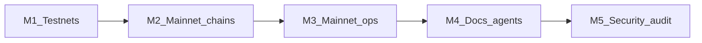

# Trustless Commerce roadmap

Status today: **Ethereum Sepolia** end-to-end (contracts, API, sweeper, UI, HTTPS gateway). Tron/Solana are commerce stubs; Base is UI labels only; mainnet contracts are not deployed.

---

## M1 — Base, Tron, and Solana (testnet)

Goal: create → pay → sweep works on each chain’s public testnet, behind `testnet.trustless-commerce.com`.

### Base Sepolia (`84532`)
- [ ] Hardhat network + `scripts/deploy-commerce.ts` deploy artifact (`data/commerce-deploy-base-sepolia.json`)
- [ ] API multi-chain config (per-`chainId` sweeper + forwarder; not a single global pair)
- [ ] Sweeper YAML: Base Sepolia RPC, USDC, wallet registration
- [ ] UI: add Base Sepolia to networks; keep create/pay paths honest (no fake mainnet Base)
- [ ] System-test or smoke script for Base Sepolia USDC

### Tron (Nile or Shasta)
- [ ] Commerce address / invoice model (reuse library Tron patterns where possible: `contracts/tron/`, `src/tron*.ts`)
- [ ] API create + sweeper claim/track for Tron invoices
- [ ] Replace `tron.enabled` stub skip in [`commerce/sweeper/worker.ts`](commerce/sweeper/worker.ts) with a real tick path
- [ ] UI network + pay instructions (TRC-20 USDT/USDC as chosen for launch)
- [ ] Activity-log stages for Tron pay/sweep

### Solana (devnet)
- [ ] Greenfield: program or PDA scheme for invoice addresses + settle/sweep authority
- [ ] TypeScript SDK helpers + API persistence
- [ ] Sweeper worker path (replace `solana.enabled` stub)
- [ ] UI network + pay instructions
- [ ] Devnet faucet/smoke docs

**Exit:** agent or merchant can create a testnet invoice on Base, Tron, and Solana; sweeper settles; activity log shows paid + sweep tx.

---

## M2 — Mainnet support for all

Goal: same product surface on production chains; configs and UI gated to **live** deployments only.

| Chain | Target | Notes |
|-------|--------|--------|
| Ethereum | Mainnet | Optional if Base is primary EVM; keep if merchants need it |
| Base | Mainnet `8453` | Primary EVM candidate (fees) |
| Tron | Mainnet | Production TRC-20 |
| Solana | Mainnet | Production SPL |

- [ ] Deploy commerce contracts / programs; commit artifacts under `data/commerce-deploy-*.json`
- [ ] Token allowlists (USDC addresses per chain) locked in API + sweeper config
- [ ] UI `NETWORKS` only lists chains with live artifacts + RPC
- [ ] Per-environment secrets: separate sweeper wallets, admin keys, DBs (testnet vs mainnet already split by gateway)

**Exit:** create/pay/sweep verified on each mainnet with small real amounts (or shadowed dry-run where required).

---

## M3 — Mainnet deploy (ops)

Goal: `https://trustless-commerce.com` is a full production stack (not just DNS + empty API).

- [ ] Fill [`deploy/.env.mainnet.example`](deploy/.env.mainnet.example) / live `.env` with mainnet addresses + RPC
- [ ] Start `mainnet-api` on `trustless-commerce-edge`; confirm gateway upstreams
- [ ] Register production sweeper(s); `AUTO_UPDATE=0` on mainnet nodes
- [ ] Activity logs + monitoring (disk, RPC errors, failed sweeps)
- [ ] Backup/restore for mainnet SQLite (or migrate off SQLite if volume requires it)
- [ ] Checklist pass in [`deploy/README.md`](deploy/README.md)

**Exit:** public mainnet health, create invoice, pay, sweep, and merchant payout observed in prod.

---

## M4 — Docs upgrade with agent targeting

Goal: humans and coding agents can integrate without reading the whole repo.

- [ ] Chain matrix in [`docs/index.md`](docs/index.md) / [`docs/agents.md`](docs/agents.md): chainId, USDC, RPC expectations, pay-link examples
- [ ] Update [`.cursor/skills/trustless-commerce-invoice/SKILL.md`](.cursor/skills/trustless-commerce-invoice/SKILL.md) beyond Sepolia-only
- [ ] API reference deltas for multi-chain create ([`docs/api.md`](docs/api.md), [`docs/create.md`](docs/create.md))
- [ ] Ops: mainnet vs testnet install paths ([`docs/ops.md`](docs/ops.md), [`deploy/install/README.md`](deploy/install/README.md))
- [ ] Explicit “not supported yet” removals once Tron/Solana ship
- [ ] Agent-oriented one-pagers: “create invoice”, “poll until paid”, “register sweeper”

**Exit:** a fresh agent can create and verify a testnet invoice from docs/skill alone; mainnet steps are clearly marked.

---

## M5 — Security audit

Goal: external review of frozen mainnet surface before (or immediately after) wider traffic.

**In scope (suggested)**
- Commerce sweeper + forwarder contracts / Solana program / Tron settle path
- API auth: admin key, sweeper wallet signatures, claim leases, track idempotency
- Invoice address derivation and payout binding (`selectedTo` / salt)
- Rate limits, CORS, captcha/merchant-key follow-ups in [`docs/security.md`](docs/security.md)
- Operator secrets handling (install `.env`, auto-update, activity logs)

**Prep**
- [ ] Freeze contract/program addresses and ABI surface for audit tag
- [ ] Expand [`docs/security.md`](docs/security.md) threat model + trust assumptions
- [ ] Fix P0/P1 findings; re-test M2/M3 paths
- [ ] Publish summary (scope, version, residual risks)

**Exit:** audit report filed; critical items closed; residual risks documented for merchants/agents.

---

## Explicitly later / out of band

- Arbitrum and other EVM L2s (UI labels exist; not a roadmap gate)
- Redis / multi-replica API
- Deposit-tx indexing (still balance-poll unless product requires it)
- Mainnet sweeper auto-update (remain off by default)

---

## Tracking

Update checkboxes here as milestones land. Operator install and Sepolia testnet remain the reference environment until M3.
