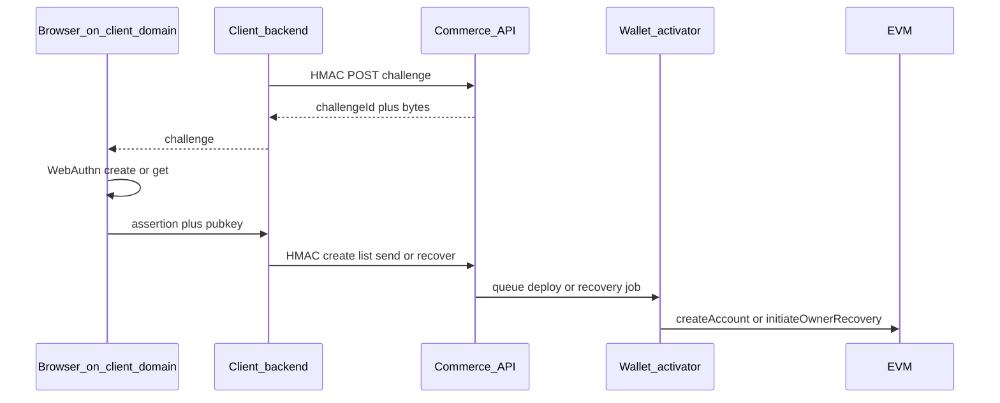

# Wallet client API (HMAC)

Partner / platform backends embed Trustless Commerce **passkey smart wallets** on **their own WebAuthn domain**. The HMAC secret stays on the partner server — never in browser JavaScript.

This is separate from the hosted product UI (`/wallet` + public `/api/wallet/*`), which uses our hostname as the WebAuthn RP ID.

## Trust model

| Party | Responsibility |
|-------|----------------|
| Partner frontend | WebAuthn `create` / `get` with `rp.id` = partner domain |
| Partner backend | Holds HMAC secret; verifies email/identity; forwards assertions |
| Trustless Commerce API | Verifies HMAC + WebAuthn; derives CREATE2 address; queues UserOps / recovery |
| Wallet activator (`wallet-deployer`) | Deploys funded wallets; runs guardian recovery txs |



## Admin: issue a wallet client

Requires `x-api-key: ADMIN_API_KEY`.

```http
POST /api/admin/wallet-clients
Content-Type: application/json
x-api-key: ADMIN_API_KEY

{
  "label": "Acme checkout",
  "rpId": "example.com",
  "origins": ["https://example.com", "https://www.example.com"]
}
```

Response **201** (secret shown once):

```json
{
  "client": {
    "id": "…",
    "label": "Acme checkout",
    "rpId": "example.com",
    "origins": ["https://example.com", "https://www.example.com"],
    "enabled": true
  },
  "hmacSecret": "hex…"
}
```

| Method | Path | Notes |
|--------|------|--------|
| GET | `/api/admin/wallet-clients` | List (no secrets) |
| POST | `/api/admin/wallet-clients/:id/rotate` | New `hmacSecret` once |
| PATCH | `/api/admin/wallet-clients/:id` | `{ "enabled": false }` etc. |

`rpId` is the WebAuthn RP ID. When `origins` is set, assertion `clientDataJSON.origin` must match exactly. When omitted, the origin host must equal `rpId` or be a subdomain of it.

## HMAC request signing

Every `/api/client/wallets*` call requires:

| Header | Value |
|--------|--------|
| `x-client-id` | Client UUID |
| `x-client-timestamp` | Unix ms (±5 min) |
| `x-client-nonce` | Unique string (replay TTL ~10 min) |
| `x-client-body-hash` | SHA-256 hex of **raw** body (`""` for GET) |
| `x-client-signature` | HMAC-SHA256 hex of the canonical message |

Canonical message:

```text
Trustless Commerce client request
Method: POST
Path: /api/client/wallets
Body-SHA256: …
Timestamp: …
Nonce: …
```

**Path is pathname only** (no `?query`). Sign `/api/client/wallets` even when listing with `?email=`.

Rate limit bucket: `wallet_client` (default ~50/s/IP, env `RATE_LIMIT_WALLET_CLIENT_PER_SECOND`).

## WebAuthn on the client origin

1. `POST /api/client/wallets/challenges` → `{ challengeId, challenge }` (`challenge` is base64url).
2. In the browser on **your** domain:

```js
await navigator.credentials.create({
  publicKey: {
    challenge: base64urlToBuffer(challenge),
    rp: { name: "Acme", id: "example.com" },
    user: { id: randomBytes(16), name: email, displayName: email },
    pubKeyCredParams: [{ alg: -7, type: "public-key" }],
    authenticatorSelection: { residentKey: "required", userVerification: "required" },
  },
});
// Extract P-256 qx/qy from attestation public key, then prove possession:
await navigator.credentials.get({
  publicKey: {
    challenge: base64urlToBuffer(challenge),
    rpId: "example.com",
    userVerification: "required",
    allowCredentials: [{ id: cred.rawId, type: "public-key" }],
  },
});
```

3. Partner backend forwards `credentialId`, `ownerQx`, `ownerQy`, `challengeId`, and the assertion (`authenticatorData`, `clientDataJSON`, `signature`) over HMAC.

**Send** does not use a server challenge: the ERC-4337 `userOpHash` is the WebAuthn challenge (same as the hosted wallet).

## Endpoints

### Challenge

```http
POST /api/client/wallets/challenges
```

```json
{ "purpose": "create" | "recover" | "cancel", "email": "optional", "walletAddress": "optional" }
```

→ `{ challengeId, challenge, expiresAt, purpose }` (TTL ~5 min, single use).

### Create

```http
POST /api/client/wallets
```

```json
{
  "email": "user@example.com",
  "contact": { "phone": "+1…" },
  "challengeId": "…",
  "ownerQx": "0x…",
  "ownerQy": "0x…",
  "credentialId": "base64…",
  "assertion": {
    "authenticatorData": "0x…|base64",
    "clientDataJSON": "{…}|base64",
    "signature": "0x…|base64"
  },
  "label": "Phone"
}
```

Counterfactual CREATE2 address (no on-chain deploy until funded). Binds `(clientId, email) → wallet`.

### List

```http
GET /api/client/wallets?email=user@example.com&chainId=11155111
```

Returns only wallets for **this** HMAC client + email. Each wallet includes `devices[]` with `credentialId`, `ownerQx`, `ownerQy`, `label` for `allowCredentials`.

### Send

```http
POST /api/client/wallets/:address/send/prepare
{ "chainId": "11155111", "token": "USDC", "to": "0x…", "amount": "1000000" }
```

→ `{ userOp, userOpHash, bundlerFeeUsdc, … }` (needs RPC).

Browser signs `userOpHash` with the passkey, then:

```http
POST /api/client/wallets/:address/send
{ "userOp": { …, "signature": "0x…" }, "userOpHash": "0x…", "credentialId": "…" }
```

Wallet must be bound to this client. Enqueued for the bundler like public `POST /api/wallet/userops`.

### Recovery

Partner must already verify email (or other IdP). We do **not** send email.

```http
POST /api/client/wallets/:address/recovery
{
  "email": "user@example.com",
  "identityVerified": true,
  "challengeId": "…",
  "ownerQx": "0x…",
  "ownerQy": "0x…",
  "credentialId": "…",
  "assertion": { … }
}
```

Queues `initiate` for the wallet activator / `wallet-deployer` worker (guardian `initiateOwnerRecovery`). CREATE2 salt stays the **original** passkey; undeployed wallets deploy with original owners then start recovery.

```http
POST /api/client/wallets/:address/recovery/cancel
{ "challengeId": "…", "credentialId": "…", "assertion": { … } }
```

Existing owner passkey; queues `cancel`.

```http
GET /api/client/wallets/:address/recovery
```

→ jobs + on-chain `pendingOwner` when RPC is configured.

After the timelock, the deployer auto-calls `executeOwnerRecovery`.

## Errors

| Code | Meaning |
|------|---------|
| 401 | Bad/missing HMAC, skew, replay, disabled client |
| 400 | Bad challenge, assertion, `identityVerified` |
| 403 | Wallet not bound to this client / email / owner device |
| 409 | Duplicate UserOp hash / claim conflict |
| 429 | Rate limit (`wallet_client`) |
| 503 | Factory / bundler / RPC not configured |

## Related

- Hosted wallet UI: `/wallet` (public `/api/wallet/*`)
- Nodes: [Sweepers](sweepers.md) (wallet activator / `wallet-deployer` also runs recovery jobs)
- Agents: skill `.cursor/skills/trustless-commerce-wallet/SKILL.md`
