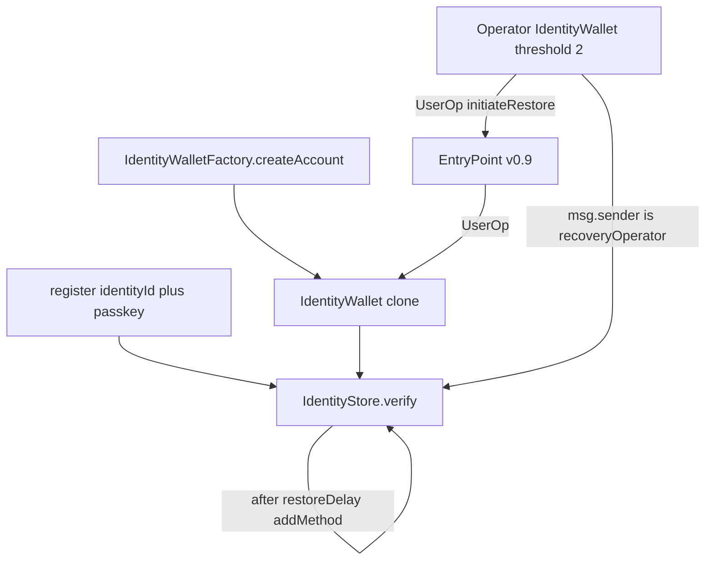

# Identity wallet internal audit

Iteration 2 (fixes that fit the design, and a second pass): [wallet-identity-audit-iteration-2.md](wallet-identity-audit-iteration-2.md).

Internal review of the hosted identity wallet. This is not a third-party audit and it is not a certification. Do not treat mainnet balances as covered until an external auditor has reviewed a frozen tag, the PoCs below, and the deployed addresses.

Reviewed contracts match git `3be1976e8b2090649fa643dd54ceacae18e32245` (`main` at the start of this review). Solidity `0.8.26`, optimizer on, 1,000,000 runs, `viaIR`, EVM target `cancun`. OpenZeppelin Contracts `5.6.1`. PoCs live in [`test/IdentityWalletAudit.ts`](../test/IdentityWalletAudit.ts) and were executed with `npx hardhat test test/IdentityWalletAudit.ts` (8 passing).

## 1. Executive summary

**Theft.** An outsider who does nothing more than watch `IdentityRegistered` can deploy their own identity at the victim's counterfactual address and spend what the victim is later told to receive. Separately, an `addMethod` signature published on chain can put a removed key back in control of the wallet. A threshold of the operator Super Wallet, and the store owner, can also install a spend method on every identity that still has restore enabled. Those two roles are trusted today. The outsider paths are not.

**Lockout.** Email recovery can be stopped forever by replaying a single cancel signature, and it can be wedged forever by one `initiateRestore` whose new key cannot be added. Both leave a user who has lost every device with no on-chain way to finish recovery. A user can also turn restore off and then remove methods until one remains. Losing that last method is permanent. While a user still holds a live method they can still spend, including in the cancel-replay case. The published lost-device path does not hold.

| Severity | Count | Ids |
|----------|------:|-----|
| Critical | 1 | AUD-01 |
| High | 4 | AUD-02, AUD-03, AUD-04, AUD-07 |
| Medium | 2 | AUD-05, AUD-06 |

## 2. Scope

In scope:

- [`contracts/wallet/IdentityStore.sol`](../contracts/wallet/IdentityStore.sol)
- [`contracts/wallet/IdentityWallet.sol`](../contracts/wallet/IdentityWallet.sol)
- [`contracts/wallet/IdentityWalletFactory.sol`](../contracts/wallet/IdentityWalletFactory.sol)
- [`contracts/wallet/IdentitySigLib.sol`](../contracts/wallet/IdentitySigLib.sol)
- [`contracts/wallet/IdentityTypes.sol`](../contracts/wallet/IdentityTypes.sol), [`contracts/wallet/IdentityErrors.sol`](../contracts/wallet/IdentityErrors.sol)
- OpenZeppelin `Account`, `ERC7821`, `WebAuthn`, `ECDSA`, and `P256` only at the call sites above

The recovery configuration under test is the one the product describes: `recoveryOperator` is an `IdentityWallet` with `enableSuper` and threshold 2. That wallet calls `IdentityStore.initiateRestore` through EntryPoint v0.9 (`0x433709009B8330FDa32311DF1C2AFA402eD8D009`). `IdentityWallet.entryPoint()` returns `ERC4337Utils.ENTRYPOINT_V09`, the same address [`commerce/shared/userop.ts`](../commerce/shared/userop.ts) uses.

Reviewed only to confirm they are a different system: [`contracts/wallet/Wallet.sol`](../contracts/wallet/Wallet.sol) and [`contracts/wallet/AdminGuardianRecovery.sol`](../contracts/wallet/AdminGuardianRecovery.sol). `IdentityWallet` does not inherit them, and `IdentityWalletFactory` clones `IdentityWallet` only. A guardian on the legacy wallet cannot call `initiateRestore`. New hosted users are specified to use the identity stack. This review does not attest to the legacy wallet.

Out of scope: commerce invoice sweepers, the HMAC partner API, card on/off-ramp, and the user-facing Super Wallet product except where it is this same bytecode (the operator wallet).

Off-chain workers are cited only where they show how long a contract bug stays exploitable. The findings below are accepted by the contracts themselves.

## 3. System model

**Identity.** `register(identityId, qx, qy)` is permissionless. The first caller creates the identity and its first WebAuthn method. `identityId` is chosen off chain. Later methods are WebAuthn, YubiKey, or EOA. `addMethod` and `removeMethod` require an IDS1 blob (`0x49445331`) that `verify` accepts for that same `identityId`. An EOA already on the identity may also call `addMethodByEoa` and `disableRestore` with `msg.sender` and no blob. Method ids are `keccak256(abi.encode(identityId, kind, qx, qy, eoa))`. At most 32 methods. `removeMethod` reverts when `methodCount <= 1`.

**Simple spend.** The clone is an ERC-4337 account. `_rawSignatureValidation` on a simple wallet returns true only when `store.verify(userOpHash, signature) == identityId`. Execution is ERC-7821. The EntryPoint and the wallet itself are the authorized executors.

**Operator Super Wallet.** `enableSuper` records the wallet's own `identityId` plus extra identities and a threshold. A `SUP1` blob (`0x53555031`) must contain at least `threshold` distinct signer identities. One identity cannot vote twice. A single IDS1 blob is accepted only when `threshold <= 1`. The production operator is threshold 2 with three identities. `initiateRestore` and `restoreAddMethod` succeed only when `msg.sender == recoveryOperator`. The new key is whatever the operator submits. It is not signed by the user. After `restoreDelay`, anyone may call `executeRestore`, which adds that key as a normal method. From then on the key spends and rotates methods like any other method on the identity. A live method can `cancelRestore` during the delay.

`restoreDelay` is unset in the constructor, so it is 0 until the owner calls `setRestoreDelay`. [`scripts/deploy-identity-wallet.ts`](../scripts/deploy-identity-wallet.ts) deploys with `recoveryOperator` defaulting to the deployer, then sets the delay in a second transaction. The intended production value is 259200 seconds.

The salt the API uses is `keccak256(abi.encode("TC-IDENTITY-WALLET-V1", identityId, index))` in [`commerce/shared/wallet-address.ts`](../commerce/shared/wallet-address.ts). The factory does not recompute it. The wallet-deployer calls `createAccount` only after USDC arrives at the predicted address, and it treats any code already at that address as a finished deploy ([`commerce/wallet-deployer/worker.ts`](../commerce/wallet-deployer/worker.ts) around the `getCode` check).

## 4. Trust assumptions that remain if the findings are fixed

- Two of the three operator identities, acting through the operator wallet, may start a restore for every identity with `restoreEnabled`. After the delay, that new method can spend and can remove other methods down to one. The test "two of three operator identities can install a spend method after the delay" runs that path, and it also shows a single operator identity is rejected with `AA24`.
- A user who still has a method can cancel during the delay. A user who has lost every method cannot cancel. Their safety is the delay plus the honesty of a threshold of operator keys.
- The store owner can call `setRecoveryOperator` and `setRestoreDelay` immediately. See AUD-06. A timelock would shrink this assumption. It would not remove the operator's power to start restores.
- Email OTP never calls `initiateRestore`. The inbox cannot move funds by itself. Losing the inbox matters only if a threshold of the operator then signs a restore the user cannot cancel.
- The EntryPoint, the bundler, and the P-256 precompile are assumed to verify what their specifications say. This review did not re-audit those codebases.

## 5. Invariants

| Id | Invariant | Result |
|----|-----------|--------|
| I1 | The identity that the API derived a salt for is the identity that can spend that address | Broken. AUD-01 |
| I2 | The passkey in the user's `register` transaction is the first method on that `identityId` | Broken if that transaction is ordered behind another `register` for the same id. AUD-07 |
| I3 | A removed method stays removed | Broken. AUD-02 |
| I4 | A cancel signature applies to one pending restore | Broken. AUD-03 |
| I5 | A pending restore can be executed or replaced | Broken when the pending method cannot be added. AUD-04 |
| I6 | Restore stays possible until at least two methods remain | Broken. AUD-05 |
| I7 | A restore waits out the production delay | Broken while `restoreDelay` is 0, including immediately after deployment. AUD-06 |
| I8 | A signature from another identity on the same store fails `_rawSignatureValidation` | Holds. AUD-01 victim UserOp reverts `AA24` |
| I9 | Fewer than `threshold` operator signatures cannot call `initiateRestore` | Holds. One-blob operator UserOp reverts `AA24`. After `setRecoveryOperator`, the previous operator address reverts `NotRecoveryOperator` |
| I10 | During a non-zero delay, a remaining user method can cancel, and `executeRestore` reverts `RestoreNotReady` | Holds. Operator test cancels the first restore. AUD-03 also shows execute does not run after cancel |
| I11 | `uint8` signer accounting does not wrap | Holds by inspection. `signerCount += 1` is checked arithmetic in 0.8.26 and reverts at 256. `uint256(1) << bit` stays unique for every `uint8` index |
| I12 | WebAuthn verification binds the UserOp hash as the challenge and requires the UV flag | Holds inside OpenZeppelin `WebAuthn.verify`, which `IdentitySigLib.verifyWebAuthn` calls. The contract does not pin `rpIdHash`. See reviewed areas |

## 6. Findings

### AUD-01 — Counterfactual address is claimed by the first `createAccount`

- **Severity:** Critical
- **Property:** Theft
- **Location:** [`IdentityWalletFactory.createAccount`](../contracts/wallet/IdentityWalletFactory.sol) lines 28–36. Salt formula in [`deriveIdentityWalletSalt`](../commerce/shared/wallet-address.ts) lines 30–36.

`createAccount(identityId, salt)` checks that `identityId` exists, then deploys a clone only when that salt has no code. It never checks that `salt` is the salt for that identity. A later call for the same salt returns the existing clone and still emits `WalletCreated` with the *caller's* `identityId`, even when the clone was initialized to someone else.

After `register` is mined, `identityId` is public in `IdentityRegistered`. Index 0 is the first wallet. Anyone can compute the salt and call `createAccount` with their own identity. The product shows that address before deployment and the deployer waits until the address holds USDC. If the attacker deploys first, the worker sees code and marks the wallet deployed.

**Sequence.** Covered by test `AUD-01`.

1. Victim identity `V` is registered. Attacker identity `A` is registered.
2. `salt = keccak256(abi.encode("TC-IDENTITY-WALLET-V1", V, 0))`.
3. Attacker calls `createAccount(A, salt)`. Victim calls `createAccount(V, salt)`. The second call does not revert.
4. `identityId()` on the predicted address is `A`.
5. A UserOp signed by `A`'s passkey runs `ping` through the EntryPoint. A UserOp signed by `V`'s passkey reverts `AA24`.

USDC sent to the address the victim was shown is spendable by `A`.

**Recommendation.** Compute the salt inside the factory from `(identityId, index)` and stop taking a free `salt` argument. If code is already present, revert unless `IdentityWallet(wallet).identityId() == identityId`. Deploy the clone in the same transaction as `register`, so the empty-address window is one transaction. Teach the worker to compare on-chain `identityId()` with the database before marking a wallet deployed.

### AUD-07 — `register` gives the identity to whoever is mined first

- **Severity:** High
- **Property:** Theft
- **Location:** [`IdentityStore.register`](../contracts/wallet/IdentityStore.sol) lines 136–151.

`register` does not check a signature from `(qx, qy)` over `identityId`. The first successful call owns that id. A second call reverts `IdentityExists`. The user's passkey coordinates sit in the pending `register` transaction. An observer who can get another `register(identityId, attackerQx, attackerQy)` mined first owns the id. With AUD-01, they also own every salt derived from it. Fixing only the factory still leaves this path: the attacker's key is the first method on the victim's id, so the correctly bound salt is the attacker's wallet.

**Sequence.** Covered by test `AUD-07`. Register with the attacker key. The victim's `register` reverts `IdentityExists`. `verify` accepts the attacker key and rejects the victim key.

This needs the legitimate `register` to lose the ordering race. AUD-01 does not. On a private sequencer the window is smaller. It is still the wrong capability model: knowledge of a random id, leaked in the transaction that creates it, is enough to claim it.

**Recommendation.** Bind `identityId` to the passkey. Have `register` check a WebAuthn assertion whose challenge is `identityId` (or set `identityId = keccak256(qx, qy, registrationCommitment)` inside the contract). A front-runner then needs the authenticator signature, not just the id.

### AUD-02 — `addMethod` and `removeMethod` signatures can be replayed

- **Severity:** High
- **Property:** Theft and lockout
- **Location:** [`IdentityStore.addMethod`](../contracts/wallet/IdentityStore.sol) lines 154–166, [`removeMethod`](../contracts/wallet/IdentityStore.sol) lines 174–183, typehashes lines 18–20.

The signed payloads are `AddMethod(identityId, kind, qx, qy, eoa)` and `RemoveMethod(identityId, methodId)`. There is no nonce, deadline, or nullifier. `verify` will accept the same blob for as long as the signing method still exists. Both transactions publish the blob in calldata.

**Sequence.** Covered by test `AUD-02`.

1. Primary passkey adds passkey `S`. The add blob is stored on chain.
2. Primary removes `S`. The remove blob is stored on chain. `S` no longer exists.
3. Anyone resubmits the original add blob. `S` is a method again. A UserOp signed by `S` passes the EntryPoint and runs `ping` on the user's wallet.
4. Anyone resubmits the original remove blob. `S` is gone again.

Step 3 is theft when `S` was removed because that device was compromised: the holder of `S` is authorized again. Step 4 is lockout of a method the user deliberately re-added. If the signing method is later removed, that method's old blobs stop verifying. A user whose only remaining method is the one that signed the add cannot remove it (`LastMethod`) and cannot invalidate the replay.

**Recommendation.** Add a per-identity nonce, or a `bytes32` authorization id, to `AddMethod`, `RemoveMethod`, and `CancelRestore`, and mark it used. Including `block.chainid` is already done by the EIP-712 domain. That does not stop same-chain replay.

### AUD-03 — One cancel signature cancels every future restore

- **Severity:** High
- **Property:** Lockout
- **Location:** [`hashCancelRestore`](../contracts/wallet/IdentityStore.sol) lines 93–98 and [`cancelRestore`](../contracts/wallet/IdentityStore.sol) lines 226–233. The typehash is `CancelRestore(bytes32 identityId)` at line 21.

The digest does not include the pending key, `executeAfter`, or a nonce. [`test/IdentityStore.ts`](../test/IdentityStore.ts) already expects the digest to be identical across two different restores. A cancel the user broadcasts to stop a bad restore can be copied and applied to the next one, including after the delay and immediately before `executeRestore`.

**Sequence.** Covered by test `AUD-03`.

1. Operator starts a restore. User cancels with passkey `P`. Save the blob.
2. Operator starts a restore of a different key. The cancel digest is unchanged. The same blob clears it.
3. Operator starts again. After the delay, the same blob clears it. `executeRestore` reverts `RestoreNotPending`. The replacement key does not `verify`.

The user can still spend with `P`. They cannot finish email recovery while `P` remains, because every new restore can be cancelled by the public blob. If `P` is the last method, `removeMethod` cannot delete it, so the blob cannot be invalidated. The lost-device path is then closed. Anyone can submit the replay. They do not need an operator key.

**Recommendation.** Sign `CancelRestore(identityId, qx, qy, eoa, executeAfter)` or a pending-restore id that changes on every `initiateRestore`.

### AUD-04 — A restore that cannot be added occupies the only slot

- **Severity:** High
- **Property:** Lockout
- **Location:** [`_initiateRestore`](../contracts/wallet/IdentityStore.sol) lines 260–284 and [`_executeRestore`](../contracts/wallet/IdentityStore.sol) lines 286–300.

There is one `pendingRestores` slot. `initiateRestore` reverts `RestorePending` while it is active. `_executeRestore` deletes the slot and then calls `_addMethod`. If `_addMethod` reverts, the delete reverts with it, so the slot stays full. `_addMethod` reverts `MethodExists` when that key is already on the identity, and `TooManyMethods` when the identity already has 32 methods. Nothing in the owner API clears a slot. `cancelRestore` requires a signature from a current method.

**Sequence.** Covered by test `AUD-04`.

1. Set a non-zero delay. `initiateRestore` the passkey that is already registered.
2. After the delay, `executeRestore` reverts `MethodExists`. `pendingRestores.active` is still true.
3. `initiateRestore` of a brand-new key reverts `RestorePending`.

A user who still has a method can cancel. A user who has lost every method cannot. That is the email-recovery case. One operator transaction, including a retry of the key already on the identity, bricks it. The store owner cannot clear it either.

The same wedge exists at 32 methods: execute reverts `TooManyMethods`, the slot stays, and a user with no live method cannot remove one to make room.

**Recommendation.** In `_initiateRestore`, revert if that method id already exists. On `TooManyMethods`, do not leave an unexecutable reservation. Add a path that clears a pending restore when `executeRestore` cannot succeed, callable by a remaining method and by the operator wallet. Do not delete the slot before `_addMethod` succeeds unless the failure is terminal and the slot is cleared in the same success path.

### AUD-05 — Restore can be turned off with a single method left

- **Severity:** Medium
- **Property:** Lockout
- **Location:** [`disableRestore`](../contracts/wallet/IdentityStore.sol) lines 186–198 and [`removeMethod`](../contracts/wallet/IdentityStore.sol) lines 174–178.

`disableRestore` requires `eoaCount > 0` and `msg.sender` to be that EOA. It does not require two methods to remain afterward. `removeMethod` refuses to delete the final method and does not look at `restoreEnabled`. There is no function that sets `restoreEnabled` back to true.

**Sequence.** Covered by test `AUD-05`.

1. Register a passkey. Add an EOA.
2. Remove the passkey. One EOA remains and restore is still on.
3. That EOA calls `disableRestore`.
4. `methodCount` is 1, `restoreEnabled` is false. `initiateRestore` reverts `RestoreIsDisabled`.

Losing that EOA leaves the identity with no spend method and no recovery. The same end state exists if the user disables while both methods exist and then removes down to one. The contracts allow the state the launch policy said they would forbid.

**Recommendation.** Revert `disableRestore` unless at least two methods will remain. While `restoreEnabled` is false, revert `removeMethod` unless at least two methods remain. Keep `LastMethod` for the restore-on case.

### AUD-06 — The recovery delay is optional and the owner can remove it

- **Severity:** Medium
- **Property:** Theft and lockout
- **Location:** [`IdentityStore`](../contracts/wallet/IdentityStore.sol) constructor lines 50–53, `setRecoveryOperator` lines 55–58, `setRestoreDelay` lines 60–63, `restoreAddMethod` lines 201–212. Deploy script [`scripts/deploy-identity-wallet.ts`](../scripts/deploy-identity-wallet.ts) lines 15–26.

`restoreDelay` is not set in the constructor. It is 0. `restoreAddMethod` calls `_executeRestore` in the same transaction when the delay is 0, so the operator installs a spend method with no cancel window. `setRestoreDelay` and `setRecoveryOperator` are `onlyOwner` and take effect in the same transaction. Either call can be repeated. Setting the delay near `type(uint64).max` makes `executeAfter = block.timestamp + restoreDelay` revert, which freezes new restores. Setting it to 0 removes the cancel window.

**Sequence.** Covered by test `AUD-06`.

1. A fresh store reports `restoreDelay == 0`. The owner moves `recoveryOperator` to another address. The owner's `restoreAddMethod` reverts `NotRecoveryOperator`.
2. The owner points `recoveryOperator` back at themselves and calls `restoreAddMethod`. The new passkey `verify`s in that same transaction.
3. The owner sets the delay to 259200 and then back to 0. `restoreAddMethod` again installs a key immediately.

On the deploy script's default, the deployer EOA is `recoveryOperator` until someone changes it, and the delay is 0 until the follow-up transaction. In that gap the deployer key can add a method to any registered identity in one transaction. After a correct production setup the same power remains with the owner, with no timelock.

**Recommendation.** Pass the delay into the constructor and revert if it is 0. Remove the same-transaction execute from `restoreAddMethod`, or revert when the delay is 0. Put `setRecoveryOperator` and `setRestoreDelay` behind a timelocked multisig. Revert if the new delay is outside a fixed range.

## 7. Reviewed areas that held

**Operator threshold.** `enableSuper` of the operator wallet, then `setRecoveryOperator` to that address. A UserOp with one of the three passkeys reverts `AA24` and does not start a restore. A `SUP1` blob with two identities starts it. `executeRestore` before the delay reverts `RestoreNotReady`. The user's original passkey can cancel. After a second 2-of-3 UserOp and the delay, the injected key's UserOp runs `ping` on the user's wallet. That last step is the accepted operator power in section 4, and the test shows the gate in front of it works.

**Outsider restore.** After the operator address is the Super Wallet, `initiateRestore` from the store owner reverts `NotRecoveryOperator`.

**Other identity on the same store.** AUD-01 submits the victim passkey against a wallet initialized to the attacker. Validation reverts `AA24`. Simple-wallet `_rawSignatureValidation` requires `verify(...) == identityId`, so a well-formed blob for a different identity does not pass.

**EntryPoint and ERC-7821.** `Account.entryPoint()` is v0.9, matching the bundler constant. `_erc7821AuthorizedExecutor` returns true for that EntryPoint or for the wallet. An arbitrary EOA cannot call `execute`. Signature checks run in `validateUserOp` before the wallet executes `callData`. `onlyEntryPointOrSelf` on `enableSuper`, `addSigner`, `removeSigner`, and `setThreshold` follows the same split. The operator test reaches `enableSuper` by impersonating the wallet, which is the self-call path, and the later UserOps go through the EntryPoint.

**Super signature rules.** `_validateSuper` rejects a blob that does not `verify`, a blob whose identity is not a signer, and a second blob for an identity already counted. Existing coverage in [`test/IdentityWalletE2e.ts`](../test/IdentityWalletE2e.ts) ("exposedValidate covers single-blob super when threshold is 1") rejects a duplicated blob. Threshold 1 would accept a single IDS1 blob. The operator wallet in this configuration is threshold 2, so that branch is off. Two operator identities can later call `setThreshold(1)`. That is an authorized change by the operator, recorded here so a deployment review checks the threshold after every operator UserOp.

**Signer counter.** `signerCount` is a `uint8` with no explicit cap. Incrementing it past 255 reverts under Solidity 0.8. The bit mask `uint256(1) << bit` does not collide for two different `uint8` indexes. This is not a wrap bug.

**WebAuthn.** `IdentitySigLib.verifyWebAuthn` decodes `(r, s, challengeIndex, typeIndex, authenticatorData, clientDataJSON)` and calls `WebAuthn.verify(abi.encodePacked(message), ...)`. That library checks that `clientDataJSON` contains `"type":"webauthn.get"` at `typeIndex`, that the challenge slice is exactly `"challenge":"<base64url(message)>"`, that the user-present and user-verified flags are set, and that `P256.verify` accepts `(r, s, qx, qy)`. It does not compare `authenticatorData[0:32]` to an expected rpId hash. OpenZeppelin documents that omission and leaves it to the authenticator. A genuine passkey signs the rpId hash inside `authenticatorData`, so another site's origin does not produce a valid assertion for this key unless it has the private key. Pinning the production rpId hash in the contract would still be worthwhile defense in depth. It is not, by itself, a way to forge a signature.

**EOA digests.** `_checkMethodSig` accepts a secp256k1 signature over the raw 32-byte message and over `hashVerify(message)` (`Verify(bytes32 message)`). Add and remove use the raw AddMethod / RemoveMethod digest. The recover-and-spend UI also signs `Verify(userOpHash)`. Those are two encodings of the same message. A `Verify` signature over a server-chosen random challenge is not a spend signature unless that challenge equals the UserOp hash. The challenge is 32 random bytes from the API. Turning one into the other is a preimage. Same-chain replay of add, remove, and cancel is AUD-02 and AUD-03. Cross-chain replay is blocked by the EIP-712 domain (`chainid` and `verifyingContract`).

**Cancel versus execute ordering.** If `executeRestore` is mined first, the new method exists and `cancelRestore` reverts `RestoreNotPending`. If cancel is mined first, execute reverts `RestoreNotPending`. With a non-zero delay the user has that whole window. The window is empty when the delay is 0 (AUD-06). After a successful execute, the new method is a full 1-of-n signer immediately.

**`verify` on a short or corrupt blob.** The natspec says bad cryptography returns `bytes32(0)` and does not revert. Blobs shorter than 4 bytes do return 0. A blob of 4 or more bytes whose tail is not a valid ABI encoding hits `abi.decode` and reverts. The caller built that blob. A reverting UserOp signature fails that UserOp. It does not authorize a different caller. Low, and not given a finding id.

**P-256 registration check.** `_assertP256` rejects only the point `(0, 0)`. Points that cannot sign fail later in `P256.verify`. They can occupy method slots. Filling those slots still requires an existing authorized method. Not an outsider theft or lockout.

**Factory initialization.** `cloneDeterministic` and `initialize` sit in one transaction. The implementation constructor calls `_disableInitializers`. A second `initialize` on a clone is blocked by `initializer`. The hole is the salt check in AUD-01, not a raw initialize front-run.

**Legacy recovery.** `AdminGuardianRecovery.initiateOwnerRecovery` calls `pause` and `recoveryAddOwner` on `IWalletRecoveryTarget`. `IdentityWallet` does not implement that interface. Pointing a legacy guardian at an identity clone does not pass `IdentityStore` verification.

## 8. Residual risks

These remain even after the findings are fixed, and an external auditor should see them beside this report and [`test/IdentityWalletAudit.ts`](../test/IdentityWalletAudit.ts).

- A threshold of the operator Super Wallet can add a spend method to every identity with restore still on. Users with no remaining method cannot cancel. The 3-day delay is the only warning, and only when it is actually set and cannot be zeroed in one owner transaction.
- Two lost operator identities, with threshold 2, stop `initiateRestore` for everyone. Users who still have a method can add keys themselves. Users who do not are stuck until the operator wallet can sign again. There is no second recovery authority in the contract.
- Loss of the store owner key freezes `setRecoveryOperator` and `setRestoreDelay`. Loss of that key together with the operator wallet ends email recovery.
- `disableRestore` is permanent. AUD-05 is the case that should be unreachable. After a fix that keeps two methods, a user who disables restore and then loses every remaining method is still locked. That should be an explicit product residual, not an accident of `removeMethod`.
- The email inbox is not an on-chain authority. A stolen inbox plus a willing operator threshold is a restore. The contract cannot see the difference.
- Deployed addresses, the on-chain `restoreDelay`, and the on-chain `recoveryOperator` were not part of this review. [`deploy/overlays`](../deploy/overlays) still shows an empty mainnet `IDENTITY_STORE_ADDRESS`. Re-check those values on the deployment that is supposed to match this code. Confirm `restoreDelay == 259200`, that `recoveryOperator` is the intended 2-of-3 wallet rather than the deployer EOA, and that the factory implementation is the `IdentityWallet` reviewed here.

External handoff: this document, the PoC file, solc `0.8.26` with the optimizer settings in [`hardhat.config.ts`](../hardhat.config.ts), OpenZeppelin `5.6.1`, and the deployed store, factory, implementation, EntryPoint, operator wallet, and owner addresses once they exist.
