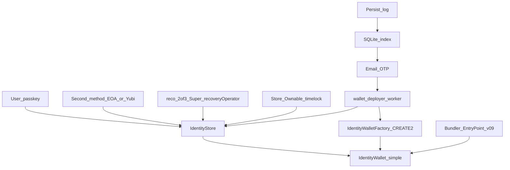
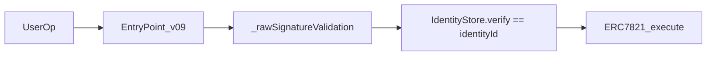
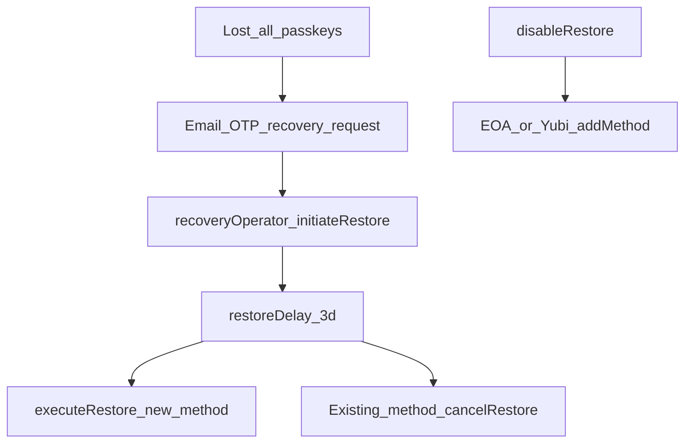
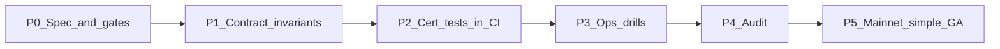

# Simple Wallet Mainnet Assurance

Program of record for **hosted simple-wallet GA** on Base. This document is the work-breakdown (epics, tasks, exit criteria) and the phased roadmap. It does **not** ship the epics; it defines them so they can be ticketed without losing the two critical-path definitions.

**Critical path A — recoverability:** a simple wallet is recoverable in every product state.

**Critical path B — fund safety:** no vulnerability that can cause user fund loss or lock-up on the certified path.

A future commit must not be able to break A or B without CI going red.

Related: [Security](security.md), [ROADMAP.md](https://github.com/naiemk/onchain-invoice/blob/main/ROADMAP.md), operator checklist in [`deploy/operator/README.md`](../deploy/operator/README.md).

---

## Launch bar (locked product policy)

| Item | Policy |
|------|--------|
| Certified path | Hosted simple wallet = [`IdentityWallet`](../contracts/wallet/IdentityWallet.sol) with `superWallet == false`, auth via [`IdentityStore`](../contracts/wallet/IdentityStore.sol), CREATE2 via [`IdentityWalletFactory`](../contracts/wallet/IdentityWalletFactory.sol), Base `8453` USDC |
| Super Wallet (user) | Stays in the product, labeled **beta / not fully audited**. Users may convert at their own risk or stay on simple. User-facing `enableSuper` is **out of the certification bar** |
| Super Wallet (operator) | **In-scope.** Email restore depends on `IdentityStore.recoveryOperator`. Today that is a reco 2-of-3 Super ([`ui/e2e/identity-email-restore.spec.ts`](../ui/e2e/identity-email-restore.spec.ts)). Simple-wallet recoverability is only as safe as that operator. Treat reco Super as **operator infrastructure**, distinct from user Super UX |
| Second method before funds | Keep on-chain `disableRestore` (permanent, no re-enable). Require a second on-chain method (EOA or YubiKey) **before** the product treats the wallet as fundable (show receive address, deployer `createAccount`, send). Email-off then still has self-recovery via the remaining method |
| Legacy stack | [`Wallet.sol`](../contracts/wallet/Wallet.sol) + [`AdminGuardianRecovery.sol`](../contracts/wallet/AdminGuardianRecovery.sol) are **not certified** for new hosted users. No new simple-legacy creates on mainnet hosted `/wallet` |
| HMAC partner API | Out of this certification (later epic) |
| Chain | Base mainnet `8453` only for this program |

Do not rely on Super upgrade copy that says email recovery is permanently disabled. That is true for **legacy** `enableAdvanced` → `_disableRecovery()`. Identity `enableSuper` does **not** call `disableRestore`.

Production `restoreDelay` is **259200 seconds (3 days)** — default in [`scripts/deploy-identity-wallet.ts`](../scripts/deploy-identity-wallet.ts) and tcmain `IDENTITY_RESTORE_DELAY`. Freeze that number for GA unless audit requires a change.

`IDENTITY_RESTORE_ENABLED` (API override of on-chain `restoreEnabled`) is a **test hook**. It must not be set on tcmain.

---

## Why this program exists (current gaps)

Recoverability is not true in every state:

- `disableRestore` has no re-enable; losing the last remaining method after that is permanent lock-up
- Undeployed + SQLite wipe needs persist-log ([`deploy/overlays/PERSIST-LOGS.md`](../deploy/overlays/PERSIST-LOGS.md))
- Worker / operator misconfig leaves restores `awaiting_operator`

Fund safety is not CI-complete:

- Hardhat covers store/wallet math ([`test/IdentityStore.ts`](../test/IdentityStore.ts), [`test/IdentityWalletE2e.ts`](../test/IdentityWalletE2e.ts))
- Playwright email + operator path is **not** in [`.github/workflows/ci.yml`](../.github/workflows/ci.yml) or [`scripts/pre-commit-ci.sh`](../scripts/pre-commit-ci.sh)
- No invariant / fuzz suite
- [Security](security.md) still describes legacy `AdminGuardianRecovery`, not IdentityStore operator
- No external audit of Identity\* contracts
- Store `Ownable` can `setRecoveryOperator` / `setRestoreDelay` with no timelock

---

## Trust diagram



### Spend path (critical path B)



Certified simple wallets never take the Super `SUP1` branch. Stranger signatures must fail AA24.

### Lost-device restore path (critical path A)



OTP session **does not** call `initiateRestore`. Operator (or an existing method via `addMethod`) is required.

---

## Threat model

### Actors

| Actor | Trust | Can |
|-------|--------|-----|
| User passkey / YubiKey / EOA on identity | User | Spend, add/remove methods, cancel pending restore |
| Email inbox | Partial | Start hosted recovery **request**; cannot restore on-chain alone |
| Reco 2-of-3 Super (`recoveryOperator`) | Operator infrastructure | `initiateRestore` for any identity with `restoreEnabled` |
| Store `Ownable` | Break-glass | `setRecoveryOperator`, `setRestoreDelay` |
| Bundler / EntryPoint | Honest execution | Submit validated UserOps; cannot forge `IdentityStore.verify` |
| wallet-deployer guardian EOA | Ops | Deploy CREATE2 when funded; execute/cancel jobs **only if** it matches `recoveryOperator` (otherwise `awaiting_operator`) |
| SQLite | Availability, not authority | Index methods/wallets/jobs; chain is source of truth |
| Persist-log | Disaster recovery | Rebuild API index after DB wipe |

### Residual risks after simple GA (accepted)

- Email inbox takeover **plus** social-engineered operator approval after the 3-day delay
- USDC sent to the CREATE2 address **before** the second-method gate (persist-log + deployer still apply; product will hide receive)
- Store-owner key compromise (mitigate with timelocked multisig in Epic 2)
- User who converts to Super accepts unaudited recovery/spend rules
- `disableRestore` + loss of **all** remaining methods (mitigate with last-method invariant + second-method-before-funds)

### Explicit non-goals

- User Super Wallet certification
- HMAC wallet client recovery ([wallet-client-api.md](wallet-client-api.md))
- Legacy `Wallet.sol` / `AdminGuardianRecovery` for new hosted users
- Multi-chain identity wallets
- MoonPay / card pay-in
- Commerce invoice sweeper audit (separate M5)

---

## State × recovery matrix (critical path A)

Every cell must have a named test id before P2 exit. `TBD-*` rows are **not yet automated**; they are scheduled tasks, not optional.

Legend: **Email** = operator `initiateRestore` after OTP. **Other-key** = existing EOA/Yubi `addMethod`. **Ops** = documented manual procedure.

| ID | State | Email / operator | Other-key add | Evidence today | Required evidence |
|----|--------|------------------|---------------|----------------|-------------------|
| S1 | Undeployed, unfunded, restore on | Yes (identity methods; wallet code may stay `0x`) | Yes | Playwright unfunded Alice | `wallet-cert` + e2e |
| S2 | Undeployed, funded, restore on | Yes; deployer `createAccount` then restore | Yes | Playwright funded Alice | `wallet-cert` + e2e |
| S3 | Deployed, restore on, passkey remaining | N/A (not lost) | Yes | IdentityStore pair / addMethod | keep |
| S4 | Deployed, all passkeys lost, restore on | Yes | If EOA/Yubi remains | Playwright email restore | `wallet-cert` + e2e |
| S5 | Pending restore, delay not elapsed | Cannot start another (`RestorePending`) | Yes; cancel with old key | IdentityStore delayed restore | add race test |
| S6 | Pending, ready to execute | Anyone `executeRestore` | Yes | IdentityStore + worker execute | `wallet-cert` |
| S7 | Cancelled pending | Can start again | Yes | IdentityStore cancel | keep + e2e cancel |
| S8 | `disableRestore` | **No** (`RestoreIsDisabled`) | **Yes** if a method remains | IdentityStore disable + Playwright block | last-method invariant **TBD-S8** |
| S9 | Email lost, other-key remains | No OTP path | Yes | Other-keys wizard / recover prove | e2e other-keys |
| S10 | Operator Super down / EOA ≠ operator | Request stuck `awaiting_operator` | Yes | Worker branch | Ops runbook **TBD-S10** |
| S11 | SQLite wiped, chain intact | After persist-log replay | After reindex | CommercePersistRecoveryE2e | live drill **TBD-S11** |
| S12 | Worker down, delay elapsed | Manual `executeRestore` (permissionless) | Yes | — | Ops runbook **TBD-S12** |
| S13 | User Super converted | Not certified | User-accepted | — | Beta banner only |
| S14 | `recoveryOperator == 0` | Initiate reverts `RestoreOperatorUnset` | Yes | IdentityStore unset operator | keep |

**Product gates scheduled (not in this doc PR):**

- Hide receive + skip deployer `createAccount` until identity has ≥2 methods
- Cannot `removeMethod` to zero remaining methods when `restoreEnabled == false`
- Cannot `disableRestore` unless `methodCount >= 2` (optional; preferred with the remove invariant)

CREATE2 salt (golden vs factory `predictAddress`):

```text
keccak256(abi.encode("TC-IDENTITY-WALLET-V1", identityId, index))
```

See [`commerce/shared/wallet-address.ts`](../commerce/shared/wallet-address.ts) `deriveIdentityWalletSalt`. Existing tests: [`test/WalletCounterfactual.ts`](../test/WalletCounterfactual.ts).

---

## Threat table (critical path B)

| ID | Attacker / failure | Impact | Mitigation | Test / evidence |
|----|--------------------|--------|------------|-----------------|
| F1 | Unknown passkey UserOp | Drain | `IdentityStore.verify` must match `identityId` | IdentityWalletE2e AA24 |
| F2 | Implementation upgrade of existing clone | Unexpected spend rules | No UUPS; factory `walletImplementation` immutable; new factory = new addresses | Factory code review + bytecode snapshot |
| F3 | Wrong `identityId` / salt at first `createAccount` | Permanent wrong controller | Salt binding tests; API uses `deriveIdentityWalletSalt` | WalletCounterfactual + CommerceIdentity |
| F4 | USDC on undeployed CREATE2, never `createAccount` | Lock-up | Deployer min-balance deploy; persist-log | persist-recovery harness + **TBD-S2** |
| F5 | Compromised reco Super | Initiate restore for any `restoreEnabled` identity | 2-of-3; 3-day delay; cancel with remaining method; store-owner break-glass under timelock | IdentityWalletE2e 2-of-3 restore + e2e |
| F6 | Compromised store owner | Swap operator / set delay 0 | Production owner = timelocked multisig | Ops + **TBD-F6** |
| F7 | `disableRestore` then lose last method | Permanent lock-up | Second method before funds; cannot remove last method if restore off | **TBD-S8** |
| F8 | Cancel vs execute race | Attacker method lands | Worker cancel-before-execute; on-chain cancel before `executeAfter` wins | Worker sort + **TBD-F8** Hardhat |
| F9 | Email OTP only | Session / request, not on-chain restore | Operator still required | CommerceIdentity + hosted recovery tests |
| F10 | SQLite / chain desync | Login vs UserOp mismatch | Chain is authority; reindex after restore/remove | persist + **TBD-S11** |
| F11 | `IDENTITY_RESTORE_ENABLED=0` in prod | Email restore silently dead | Ban on tcmain env examples; cert test | **TBD-F11** |
| F12 | User Super (`enableSuper`) | Uncertified spend/recovery | Beta warning; out of bar | Copy + UX |

**P0 rule:** no P0 without a mitigation and a test or ops procedure id.

---

## Epics

Each epic: goal, in/out of scope, tasks, exit, evidence.

### Epic 0 — Scope freeze and threat model

**Goal:** One agreed launch bar, trust diagram, and residual-risk list.

**In scope:** This document; [Security](security.md) IdentityStore section; Super beta copy (UI/legal) as a follow ticket.

**Out of scope:** Implementing gates or CI.

**Tasks:**

- [x] Publish this program document
- [ ] Super beta banner + legal: not fully audited; stay on simple or use at own risk
- [ ] Align Super upgrade strings so they do not claim Identity `enableSuper` disables email restore
- [ ] Freeze “no new hosted legacy Wallet.sol creates” in create/wallet-config

**Exit:** Policy in this file; security.md describes IdentityStore operator, not only AdminGuardian.

**Evidence:** this page; security.md; ROADMAP.md M-wallet.

---

### Epic 1 — Recoverable in every state (path A)

**Goal:** Every matrix cell is recoverable or has an explicit residual + ops procedure.

**In scope:** Second-method-before-funds; last-method / disableRestore invariants; operator runbook; cancel vs execute; prod ban of restore env override.

**Out of scope:** User Super recovery certification.

**Tasks:**

- [ ] API/UI: hide receive address until identity has ≥2 on-chain methods
- [ ] wallet-deployer: skip `createAccount` until ≥2 methods (persist-log still covers premature deposits)
- [ ] Solidity: if `restoreEnabled == false`, revert `removeMethod` that would leave zero methods
- [ ] Solidity (preferred): revert `disableRestore` unless `methodCount >= 2`
- [ ] Operator runbook: reco 2-of-3 as `recoveryOperator`; S10/S12 procedures; break-glass `setRecoveryOperator` only via Epic 2 timelock
- [ ] Hardhat: cancel mined before delay wins against `executeRestore` (F8)
- [ ] Remove or ignore `IDENTITY_RESTORE_ENABLED` on tcmain examples; fail boot if set in production-like config
- [ ] Keep lost-device cancel UX on simple; do not require user Super for cancel

**Exit:** every matrix cell has a named test id or ops procedure; no cell is “hope the worker is up” without **TBD-S12**.

---

### Epic 2 — No fund loss or lock-up (path B)

**Goal:** Spend only via validated simple-wallet UserOps; recovery cannot lock funds; governance is slow.

**In scope:** CREATE2 goldens; store-owner timelock; drain-after-restore / drain-after-disable; counterfactual USDC; email-takeover residual documented.

**Tasks:**

- [ ] Bytecode/ABI snapshots for IdentityStore, IdentityWallet, IdentityWalletFactory
- [ ] Certify in docs: new implementation requires new factory and new addresses
- [ ] Production store owner = timelocked multisig; `setRecoveryOperator` / `setRestoreDelay` are break-glass
- [ ] Hardhat: spend after successful restore; spend after disableRestore using remaining EOA/Yubi; AA24 still holds
- [ ] Document F4: deployer min-balance + persist-log; never “unreachable because never deployed”
- [ ] User Super: beta warning on convert; converting **leaves the certified bar**

**Exit:** threat table fully filled; no P0 without mitigation.

---

### Epic 3 — Certification tests (commits cannot silently break A/B)

**Goal:** Breaking email restore, cancel, execute, second-method gate, or UserOp auth is red on `main` without `--no-verify` / skipped CI.

**In scope:** Tagged Hardhat `wallet-cert`; CI job for identity email restore (or equivalent); snapshots; CODEOWNERS.

**Out of scope:** Full UI e2e suite in precommit (too slow); optional Foundry later.

**Tasks:**

- [ ] Tag suite `wallet-cert`: existing IdentityStore delay/cancel/execute/disable + IdentityWallet UserOp + Super-as-operator initiateRestore ([`test/IdentityWalletE2e.ts`](../test/IdentityWalletE2e.ts) “2-of-3 initiates a delayed identity restore”) + new matrix / F8 / last-method tests
- [ ] Required GitHub Actions job for [`ui/e2e/identity-email-restore.spec.ts`](../ui/e2e/identity-email-restore.spec.ts) (or a headless subset). Precommit may stay `npm test` + `ui:build` if the e2e job is required on PRs
- [ ] ABI/bytecode snapshots; PR fails on accidental bytecode change
- [ ] `CODEOWNERS` on `contracts/wallet/Identity*.sol` and cert tests
- [ ] Optional later: Foundry invariants (method count, pending XOR restoreEnabled, operator Super threshold)
- [ ] Ban `IDENTITY_RESTORE_ENABLED` in [`deploy/overlays/env.api.tcmain.example`](../deploy/overlays/env.api.tcmain.example) and dist copies

**Exit:** a commit that breaks path A or B fails CI.

**Evidence today (not yet a gate):**

- [`test/IdentityStore.ts`](../test/IdentityStore.ts) — register, verify, disableRestore, delayed initiate/cancel/execute, addMethod after disable
- [`test/IdentityWalletE2e.ts`](../test/IdentityWalletE2e.ts) — ping, AA24, factory idempotency, 2-of-3 operator restore
- [`test/CommerceIdentity.ts`](../test/CommerceIdentity.ts) — sessions, recover prove, restore_disabled flag
- [`test/CommercePersistRecoveryE2e.ts`](../test/CommercePersistRecoveryE2e.ts) / [`test/helpers/persist-recovery-harness.ts`](../test/helpers/persist-recovery-harness.ts)
- [`ui/e2e/identity-email-restore.spec.ts`](../ui/e2e/identity-email-restore.spec.ts) — reco Super operator, unfunded, cancel, funded+pay, disableRestore (local stack only)

---

### Epic 4 — Mainnet ops and live drills

**Goal:** Production wiring and a signed drill log, not only Hardhat.

**Tasks:**

- [ ] [`deploy/operator/README.md`](../deploy/operator/README.md) step 6: `npm run wallet:deploy:base`, copy `IDENTITY_STORE_ADDRESS` / `WALLET_FACTORY_ADDRESS`, fund bundler + wallet-deployer, set `recoveryOperator` to reco 2-of-3 Super
- [ ] Confirm on-chain `restoreDelay == 259200`
- [ ] Live Base drill (throwaway identity): unfunded restore, funded restore+pay, cancel, disableRestore + EOA add, persist-log replay
- [ ] Monitoring: recovery job age, `awaiting_operator`, failed execute, store-owner txs
- [ ] SQLite backup + persist-log backup as recovery inputs

**Exit:** drill log with tx hashes attached here or in ops notes.

---

### Epic 5 — External audit

**Goal:** Independent review of the frozen simple-wallet + operator-Super surface.

**In scope:** IdentityStore, IdentityWallet, IdentityWalletFactory, IdentitySigLib, IdentityTypes, IdentityErrors; operator Super **only** as `recoveryOperator` (`initiateRestore` UserOp).

**Out of scope:** User Super UX, commerce invoices, MoonPay, HMAC client API.

**Tasks:**

- [ ] Freeze git tag + addresses/ABIs
- [ ] Hand this document + threat model + cert test list + residuals to auditors
- [ ] Fix P0/P1; recertify CI
- [ ] Publish summary (scope, version, residuals: email+operator trust, Super beta)

**Exit:** audit report filed; P0/P1 closed; residuals listed for users.

---

### Later (not a simple-GA gate)

- User Super Wallet certification (own assurance program)
- HMAC partner recovery certification
- Foundry invariant/fuzz campaign
- Multi-chain identity wallets

---

## Roadmap



| Phase | When | What | Exit |
|-------|------|------|------|
| **P0** | Week 1 | Freeze policy (this doc); Super beta copy; second-method-before-fund spec; matrix filled (tests may still be TBD) | Epic 0 |
| **P1** | After P0 | Solidity last-method / disableRestore invariants; store-owner timelock design | Epic 1 contract tasks + Epic 2 governance |
| **P2** | After P1 | `wallet-cert` Hardhat + snapshots + CODEOWNERS + required CI for identity-email-restore | Epic 3 |
| **P3** | After P2 | Base live drills, monitoring, persist-log backups | Epic 4 |
| **P4** | After P3 | External audit of frozen tag | Epic 5 |
| **P5** | After P4 | Simple wallet GA on `https://trustless-commerce.com`; Super remains beta banner | Paths A and B certified |

User Super certification is **later**, not a gate for P5.

---

## Tracking

Update checkboxes in the epics as work lands. Do not mark P5 until:

1. Matrix cells S1–S12 and F1–F12 have tests or named ops procedures
2. `wallet-cert` + identity-email-restore CI are required on `main`
3. Live drill log exists
4. Audit P0/P1 are closed

Simple GA does **not** wait on user Super audit.
