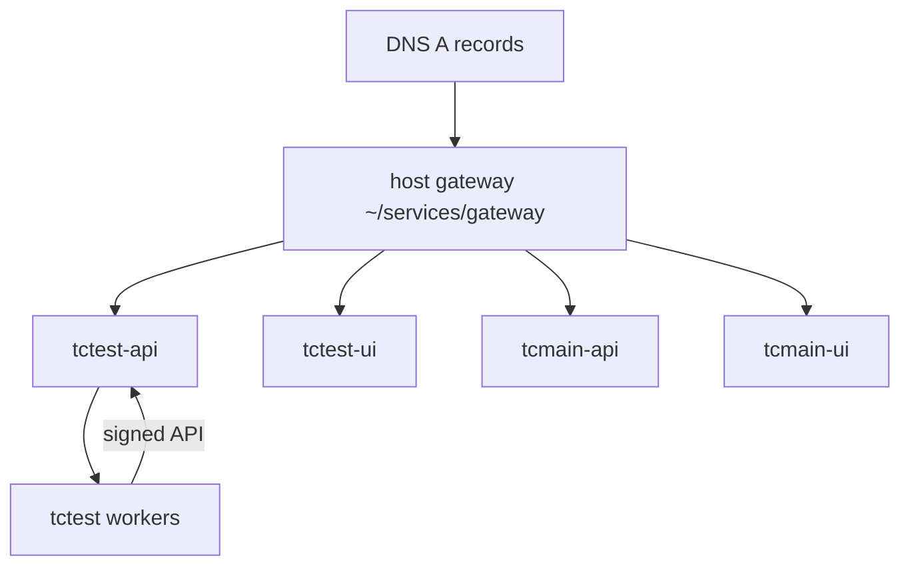

# Trustless Commerce — VPS deployment (vibed-infra 0.8)

Operator runbook for published GHCR images on a host. Installers live in committed **product dist** folders (not `deploy/install/`):

| Product | Dist | Role |
|---------|------|------|
| **tctest** | [`deploy/tctest/dist/`](../deploy/tctest/dist/) | testnet |
| **tcmain** | [`deploy/tcmain/dist/`](../deploy/tcmain/dist/) | mainnet |

Package after template/overlay changes: `npm run deploy:package` (commit both `dist/` trees). Automated checks: [`README.md`](README.md).

Images (tag `:main`):

| Image | Role |
|-------|------|
| `ghcr.io/naiemk/trustless-commerce-api` | Commerce API + SQLite |
| `ghcr.io/naiemk/trustless-commerce-sweeper` | Sweepers / bundler / wallet-deployer |
| `ghcr.io/naiemk/trustless-commerce-ui` | Static UI |

HTTPS edge is the **host gateway** (`~/services/gateway`) from vibed-infra — there is no product nginx image. GHCR `:main` pushes notify the VPS update-agent via OIDC for instant pull.



---

## 0) Prerequisites

- Docker + Compose, `curl`/`wget`, `python3`
- Ports **80** / **443** free for the host gateway
- DNS for testnet + apex (see each dist `DNS-SKILL.md`)

Layout under `~/services/` (machine) and product install dirs (operator choice, e.g. `~/tc/tctest-api`).

---

## 1) Install (example: tctest)

```bash
mkdir -p ~/tc/tctest-api && cd ~/tc/tctest-api
wget -qO- https://raw.githubusercontent.com/naiemk/onchain-invoice/main/deploy/tctest/dist/install-api.sh | bash
# edit .env (DOCKER_NAME=tctest-api, DOCKER_NETWORK=vps-edge, keys, contracts)
./start-api.sh

mkdir -p ~/tc/tctest-ui && cd ~/tc/tctest-ui
wget -qO- https://raw.githubusercontent.com/naiemk/onchain-invoice/main/deploy/tctest/dist/install-ui.sh | bash
./start-ui.sh

mkdir -p ~/tc/tctest-nodes && cd ~/tc/tctest-nodes
wget -qO- https://raw.githubusercontent.com/naiemk/onchain-invoice/main/deploy/tctest/dist/install-nodes.sh | bash
./start-nodes.sh
# start-nodes upserts the sweeper wallet; optional manual: ./register-onchain-invoice-node.sh

# Once per host (or second product only extends sites.conf):
wget -qO- https://raw.githubusercontent.com/naiemk/onchain-invoice/main/deploy/tctest/dist/install-gateway.sh | bash
```

Repeat with `deploy/tcmain/dist/` for mainnet (`DOCKER_NAME=tcmain-api`, distinct keys).

---

## 2) Ops checklist

```bash
curl -fsS https://testnet.trustless-commerce.com/api/health
docker ps --format 'table {{.Names}}\t{{.Status}}\t{{.Image}}'
# Manual recreate: cd install-dir && ./start-api.sh  (or start-nodes.sh / start-ui.sh)
```

Skip pull: `PULL=0` or `ONCHAIN_INVOICE_SKIP_PULL=1`. Branch override: set `PRODUCT_RAW` / `PACKAGECONFIG_URL` to the branch raw URLs under `deploy/tctest/dist`.

---

## Related

- Deploy overview: [`deploy/README.md`](../deploy/README.md)
- Operator CREATE2 console: [`deploy/operator/README.md`](../deploy/operator/README.md)
- Local image suite: [`README.md`](README.md)
