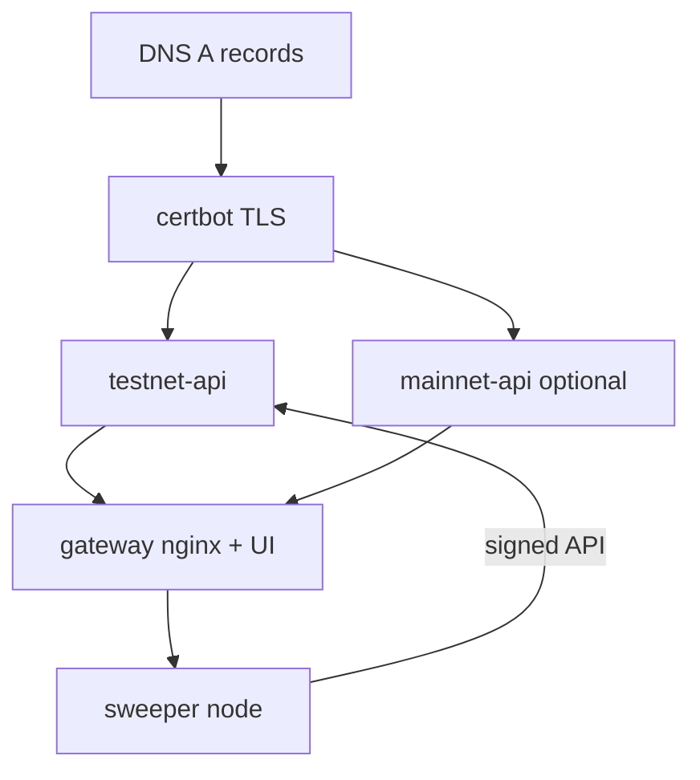

# Trustless Commerce — VPS deployment (wget | bash)

Operator runbook for deploying published GHCR images on a host (e.g. `dtn-node`).  
Installer sources: [`deploy/install/`](../deploy/install/). Automated checks: [`README.md`](README.md) (`npm run system-test` / `system-test:install`).

Images (tag `:main` unless overridden):

| Image | Role |
|-------|------|
| `ghcr.io/naiemk/trustless-commerce-api` | Commerce API + SQLite |
| `ghcr.io/naiemk/trustless-commerce-sweeper` | Sweeper node |
| `ghcr.io/naiemk/trustless-commerce-ui` | Static UI |
| `ghcr.io/naiemk/trustless-commerce-nginx` | HTTPS edge |



---

## 0) Host prerequisites

- Docker (and preferably Compose)
- Ports **80** / **443** free for the gateway (disable host nginx if it binds them)
- `curl` or `wget`, `python3`, `crontab` (for auto-update)
- DNS A records for `@`, `www`, `testnet` → this host

Suggested layout:

```text
~/tc/api-testnet/   # testnet API
~/tc/api-mainnet/   # mainnet API (optional)
~/tc/gateway/       # UI + nginx
~/tc/sweeper/       # sweeper node
```

---

## 1) DNS + TLS (once)

```bash
# Port 80 must be free (stop host nginx / gateway first if needed)
sudo certbot certonly --standalone \
  -d trustless-commerce.com \
  -d www.trustless-commerce.com \
  -d testnet.trustless-commerce.com
```

Certs live on the host under `/etc/letsencrypt/live/trustless-commerce.com/` (never in git). Gateway mounts them read-only.

---

## 2) Testnet API

```bash
mkdir -p ~/tc/api-testnet && cd ~/tc/api-testnet
wget -qO- https://raw.githubusercontent.com/naiemk/onchain-invoice/main/deploy/install/install-api.sh | bash
```

Edit `.env` (created from template):

| Key | Purpose |
|-----|---------|
| `ADMIN_API_KEY` / `SWEEPER_API_KEY` | Secrets (match sweeper register / legacy key) |
| `BASE_URL` | `https://testnet.trustless-commerce.com` |
| `DOCKER_NETWORK` | `trustless-commerce-edge` |
| `DOCKER_NAME` | `testnet-api` (nginx upstream name) |
| `EVM_RPC_URL` / `SWEEPER_ADDRESS` / `FORWARDER_IMPLEMENTATION` | Sepolia (see `data/commerce-deploy-sepolia.json`) |
| `API_AUTO_UPDATE` | Default `0` (opt-in) |

```bash
./start-onchain-invoice-api.sh
curl -fsS http://localhost:8080/api/health
# After gateway is up:
curl -fsS https://testnet.trustless-commerce.com/api/health
```

Re-running install refreshes `.env.example` and **appends** missing auto-update keys; it does **not** overwrite existing secrets in `.env`.

---

## 3) Mainnet API (optional)

```bash
mkdir -p ~/tc/api-mainnet && cd ~/tc/api-mainnet
wget -qO- https://raw.githubusercontent.com/naiemk/onchain-invoice/main/deploy/install/install-api.sh | bash
```

In `.env`:

- `BASE_URL=https://trustless-commerce.com`
- `DOCKER_NAME=mainnet-api`
- `DOCKER_NETWORK=trustless-commerce-edge`
- Distinct admin/sweeper keys; set mainnet contract addresses when live
- If host port 8080 is taken, set `docker.port: 8081` in `onchain-invoice-api.yaml`

Gateway nginx resolves `mainnet-api` optionally (starts even if mainnet API is absent).

---

## 4) HTTPS gateway (UI + nginx)

```bash
mkdir -p ~/tc/gateway && cd ~/tc/gateway
wget -qO- https://raw.githubusercontent.com/naiemk/onchain-invoice/main/deploy/install/install-gateway.sh | bash
# confirm TLS_* paths in .env match certbot
./start-onchain-invoice-gateway.sh
```

Starts containers:

| Name | Image |
|------|--------|
| `testnet-ui` | `trustless-commerce-ui` |
| `mainnet-ui` | `trustless-commerce-ui` |
| `onchain-invoice-gateway` | `trustless-commerce-nginx` on 80/443 |

Routing:

| Host | UI | API |
|------|----|-----|
| `https://testnet.trustless-commerce.com` | `testnet-ui` | `testnet-api:8080` |
| `https://trustless-commerce.com` (+ `www`) | `mainnet-ui` | `mainnet-api:8080` |

Verify:

```bash
curl -fsS https://testnet.trustless-commerce.com/api/health
```

---

## 5) Sweeper node (testnet)

```bash
mkdir -p ~/tc/sweeper && cd ~/tc/sweeper
wget -qO- https://raw.githubusercontent.com/naiemk/onchain-invoice/main/deploy/install/install-nodes.sh | bash
```

Important `.env` keys:

| Key | Notes |
|-----|--------|
| `API_URL` / `SERVER_URL` | `https://testnet.trustless-commerce.com` (prefer public HTTPS, not `host.docker.internal`) |
| `ADMIN_API_KEY` | Same as testnet API |
| `SWEEPER_WALLET_KEY` / `SWEEPER_REGISTER_ADDRESS` | Testnet example uses Hardhat #0 — throwaway only |
| `SWEEPER_ADDRESS` / `EVM_RPC_URL` | Sepolia sweeper contract |
| `ACTIVITY_LOG_PATH` | Default `/data/logs/activity.jsonl` (host: `./logs/`) |
| `NODES_AUTO_UPDATE` | Default `1` on testnet template |

```bash
./register-onchain-invoice-node.sh   # once per API DB / wallet
./start-onchain-invoice-nodes.sh

docker logs -f onchain-invoice-node
tail -f ~/tc/sweeper/logs/activity.jsonl
```

### Registration vs image updates

Registration is stored in the **API SQLite** (`sweepers` table), keyed by wallet address. Recreating the sweeper container keeps the same `.env` keys → **no re-register** unless you change the wallet or wipe the API data dir.

### Activity log stages

JSONL on the host (`./logs/activity.jsonl`):

- `invoice-paid` — non-zero balance observed
- `sweep-submitted` / `sweep-confirmed` — sweep tx hash + amounts
- `sweep-failed` / `tick-failed` — errors

Quote `0x…` values in YAML (installer templates already do). Unquoted YAML 1.1 parses them as integers and corrupts private keys.

---

## 6) Auto-update (cron)

Each install dir can schedule `update-onchain-invoice-*.sh` via `./install-auto-update.sh` (role auto-detected from files present).

### Flags

| Flag | Container | Default |
|------|-----------|---------|
| `UI_TESTNET_AUTO_UPDATE` | `testnet-ui` | on |
| `UI_MAINNET_AUTO_UPDATE` | `mainnet-ui` | on |
| `GATEWAY_AUTO_UPDATE` | nginx | on |
| `NODES_AUTO_UPDATE` | sweeper | on (testnet example; use `0` on mainnet) |
| `API_AUTO_UPDATE` | API | **off** |

Intervals: `GATEWAY_AUTO_UPDATE_INTERVAL_MIN` (5), `NODES_AUTO_UPDATE_INTERVAL_MIN` (15), `API_AUTO_UPDATE_INTERVAL_MIN` (15).  
Stop grace: `GATEWAY_STOP_TIMEOUT`, `NODES_STOP_TIMEOUT`, `API_STOP_TIMEOUT`.

### Algorithm

1. Cron runs the role’s `update-*.sh` every N minutes.
2. If the relevant flag is off → exit.
3. `docker pull` configured image(s).
4. Compare running container `Image` id vs pulled tag `Id`.
5. If unchanged → no-op; else `docker stop -t …` (sweeper drains in-flight tick), then recreate (`start-*.sh` with `PULL=0`, or selective UI/nginx recreate).
6. Append to `./logs/auto-update.log`.

```bash
cd ~/tc/gateway && ./install-auto-update.sh
cd ~/tc/sweeper && ./install-auto-update.sh
cd ~/tc/api-testnet && ./install-auto-update.sh   # only if API_AUTO_UPDATE=1

crontab -l | grep onchain-invoice-auto-update
tail -f ~/tc/gateway/logs/auto-update.log
```

Legacy `AUTO_UPDATE` is still accepted if the role-specific flag is unset.

---

## 7) Operational checklist

```bash
# Health
curl -fsS https://testnet.trustless-commerce.com/api/health

# Containers
docker ps --format 'table {{.Names}}\t{{.Status}}\t{{.Image}}'

# API data (SQLite) — uid 1000
ls -la ~/tc/api-testnet/data/

# Sweeper activity
tail -f ~/tc/sweeper/logs/activity.jsonl

# Manual recreate (pull + replace)
cd ~/tc/api-testnet && ./start-onchain-invoice-api.sh
cd ~/tc/gateway && ./start-onchain-invoice-gateway.sh
cd ~/tc/sweeper && ./start-onchain-invoice-nodes.sh
```

Skip pull: `PULL=0` or `ONCHAIN_INVOICE_SKIP_PULL=1`.  
Dev branch installers: `ONCHAIN_INVOICE_RAW=https://raw.githubusercontent.com/naiemk/onchain-invoice/<ref>/deploy/install`.

---

## 8) Known pitfalls

| Symptom | Fix |
|---------|-----|
| `invalid private key` | Quote `0x` keys in YAML; ensure `SWEEPER_WALLET_KEY` reaches the container (`docker inspect … \| grep SWEEPER`) |
| `SQLITE_CANTOPEN` | Data dir must be writable by uid `1000` (start script `chown`s) |
| Sweeper `503` / invoice list fail | Empty `SWEEPER_API_KEY` or wallet not registered |
| Gateway fails resolving `mainnet-api` | Use current `domains.conf` (optional upstream via Docker DNS variables) |
| Auto-update missing in `.env` | Re-run install script — appends missing flags; refresh cron with `./install-auto-update.sh` |
| Host nginx fights Docker | Stop/disable host nginx; gateway container owns 80/443 |

---

## Related

- Installer detail: [`deploy/install/README.md`](../deploy/install/README.md)
- Domains compose (alternative): [`deploy/docker-compose.domains.yml`](../docker-compose.domains.yml)
- Product roadmap: [`ROADMAP.md`](../ROADMAP.md)
- Local image suite: [`README.md`](README.md)
